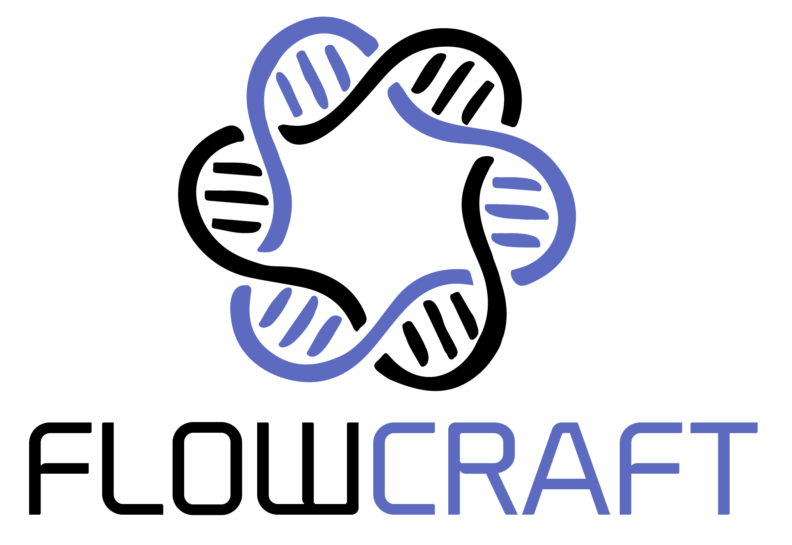

.. FlowCraft-ZH documentation master file, created by
   sphinx-quickstart on Thu Feb 14 18:36:20 2019.
   You can adapt this file completely to your liking, but it should at least
   contain the root `toctree` directive.

FlowCraft 中文文档
========================================

A NextFlow pipeline assembler for genomics.

.. toctree::
   :maxdepth: 1
   :caption: 入门

   getting_started/overview
   getting_started/installation
   getting_started/about

.. toctree::
   :maxdepth: 1
   :caption: 用户指南

   user_guide/basic_usage
   user_guide/pipeline_building
   user_guide/pipeline_configuration
   user_guide/pipeline_inspection
   user_guide/pipeline_reports
   user_guide/available_components

.. toctree::
   :maxdepth: 1
   :caption: 开发者指南

   devloper_guide/general_orientation
   devloper_guide/create_process
   devloper_guide/create_template
   devloper_guide/create_recipe
   devloper_guide/containers
   devloper_guide/process_dotfiles
   devloper_guide/pipeline_reporting
   devloper_guide/reports

.. toctree::
   :maxdepth: 1
   :caption: Source API

   source_api/flowcraft

Indices and tables
==================

* :ref:`genindex`
* :ref:`modindex`
* :ref:`search`
